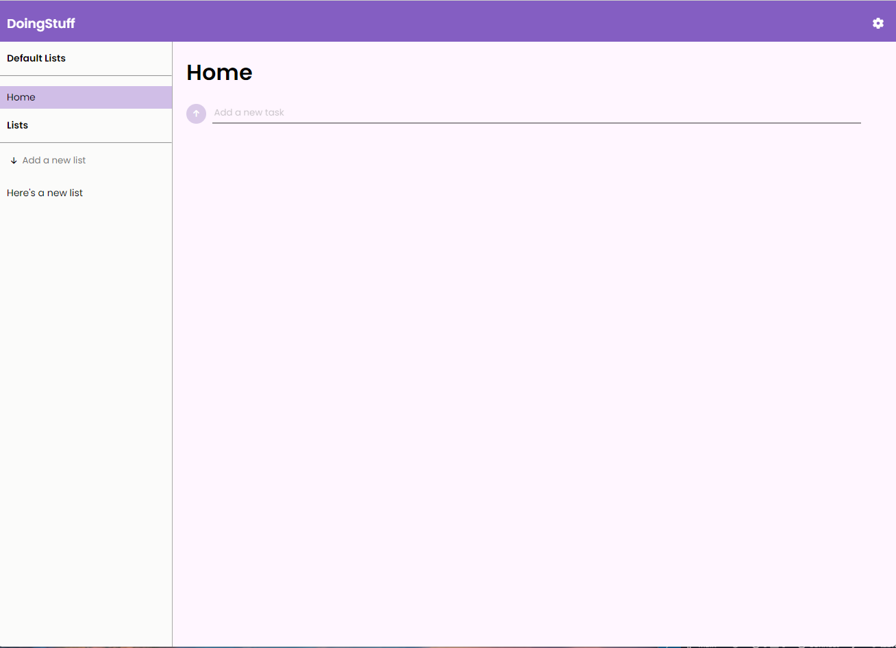

# Todo List (Node.js)

---
## [doingstuff.onrender.com](https://doingstuff.onrender.com/)
A simplistic application for creating todo lists. 

### Technologies used 
- [Node.js](https://nodejs.org/en)
- [Handlebars](https://handlebarsjs.com/guide/#what-is-handlebars) (HTML templating language to help display a user's data)
- [Passport.js](https://www.passportjs.org/) (Middleware for user authentication)
- [Sequelize](https://sequelize.org/) (An object relational mapper for making database queries)

### Helpful resources
- [alex996 Authentication Notes](https://github.com/alex996/presentations/blob/master/auth.md) - Some core concepts of authentication on the web.
- [How to manage sessions with Node.js](https://arctype.com/blog/node-session/) - An example of an initial setup of a Node app using sessions, Passport, and Sequelize.
- [Passport Documentation](https://www.passportjs.org/concepts/authentication/) 
- [Sequelize Doumentation](https://sequelize.org/docs/v6/category/core-concepts/)
- [URL Building in Express.js](https://www.pabbly.com/tutorials/express-js-url-building/)
